# Real-Time Financial Fraud Detection System

## Solution architecture report

**Status:** Proposed  
**Audience:** Architecture Review Board, Fraud Operations, Risk and Compliance, Security, SRE, and Engineering  
**Primary design target:** Sustain 1,000 transactions per second (TPS) at peak while producing a fraud decision in real time, retaining an immutable replayable record, and scaling economically.

## 1. Executive summary

The proposed system uses an event-driven, cloud-native architecture. A transaction is accepted through a secured ingestion API, durably appended to a partitioned event stream, enriched, scored by a versioned machine-learning model, and converted into a final decision. High-confidence fraud decisions create durable alerts that are pushed to analysts in real time. Every accepted transaction and every derived decision remains traceable and replayable.

The event log is the system's durable transport and short-to-medium-term replay source. An immutable object-store archive is the long-term compliance system of record. Operational query stores are projections, not authoritative transaction records. This distinction makes rebuilding state, auditing model decisions, and replaying transactions predictable.

The design favors availability and safe degradation. If model scoring is temporarily unavailable, accepted transactions remain durably queued and are processed when capacity recovers. Where the bank's payment authorization flow requires an immediate allow/decline response, a tightly bounded synchronous decision endpoint is provided; timeout behavior is governed by product- and jurisdiction-specific fail-open/fail-closed policy. Analyst alerting and reporting remain asynchronous.

### Requirement-to-design traceability

| Requirement | Architectural response | Verification |
|---|---|---|
| Real-time analysis | Partitioned stream, in-memory enrichment, online feature store, autoscaled scoring workers | End-to-end decision latency SLO and load tests |
| Replayable transactions | Durable event log plus immutable, versioned object archive; schema and model version on every decision | Quarterly restore/replay exercise |
| 1,000 TPS peak | Capacity designed and tested at 2,000 TPS; partitioned consumers and horizontal scaling | Scheduled peak and soak tests |
| Elastic scaling | Kubernetes HPA/KEDA from stream lag, throughput, CPU, and latency | Scale-up/down game day |
| Real-time analyst alerts | Alert service, materialized alert store, BFF, WebSocket/SSE push | Alert freshness SLO |
| Operational observability | OpenTelemetry traces/metrics/log correlation, SLO dashboards, paging and runbooks | Synthetic probes and alert tests |

## 2. Scope, assumptions, and quality attributes

### In scope

- Accepting payment transaction facts from trusted bank channels.
- Durable capture, validation, enrichment, feature retrieval, model inference, rules, decisioning, alerting, analyst workflow, reporting, replay, and operational observability.
- Explainability and an auditable chain from input through model and rules to analyst action.

### Out of scope

- Training-data science, feature research, and model selection beyond the production interfaces and governance controls.
- The core payment ledger and final settlement.
- Customer notification and card blocking. These should subscribe to approved downstream decision events under separate policy controls.

### Assumptions

- Input systems provide a globally unique `transaction_id`; otherwise the edge creates one and returns it.
- Average serialized event size is approximately 2 KB. At 1,000 TPS this is about 2 MB/s or 173 GB/day before replication and compression. Retention sizing must use measured production distributions.
- The bank deploys to three availability zones in one primary region, with a warm standby region. Exact recovery objectives require business impact analysis.
- A high-confidence alert threshold and any automatic decline threshold are independently owned, approved, and versioned by Risk.
- Personally identifiable information (PII) is minimized in events; tokens reference protected customer data where possible.

### Quality-attribute priorities

1. **Correctness and auditability:** no silently lost accepted transaction; explainable, versioned outcomes.
2. **Low latency:** a decision is useful only before the payment or analyst response window closes.
3. **Availability and resilience:** isolate failures and buffer bursts without corrupting results.
4. **Security and privacy:** least privilege, encryption, purpose limitation, and tamper evidence.
5. **Elasticity and cost:** scale compute with demand while retaining sufficient baseline capacity.

## 3. System context

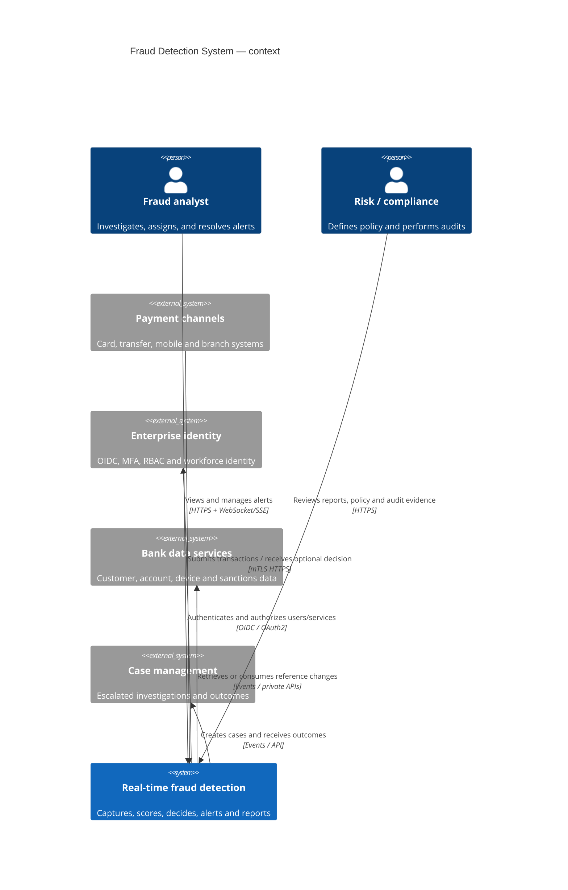

The trust boundary is explicit: payment producers are authenticated workloads; analysts are authenticated people with MFA; administrative/model operations use separate privileged roles. All service traffic remains private.

## 4. Logical architecture

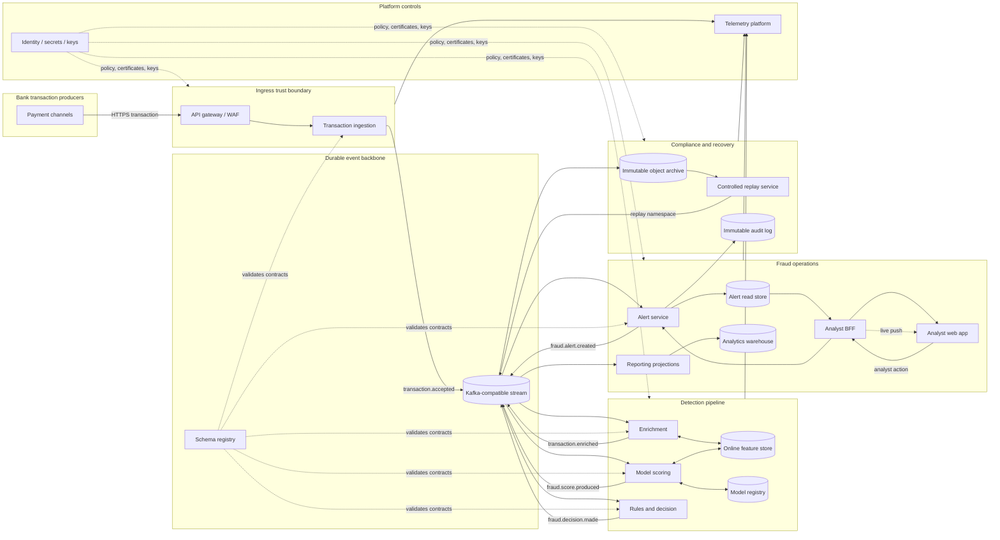

The stream decouples acceptance from downstream work, absorbs bursts, and lets each consumer scale independently. Database-per-service ownership prevents runtime coupling. Consumers never query another service's private database.

## 5. Core services and contracts

| Service | Primary responsibility | Inputs | Outputs / owned data | Communication and scaling |
|---|---|---|---|---|
| API gateway | WAF, mTLS, OAuth, quotas, routing, request-size limits | HTTPS requests | Authenticated request context | Managed edge scaling; no business logic |
| Transaction ingestion | Validate, tokenize/minimize, deduplicate, assign correlation metadata, durably accept | Canonical transaction command | `transaction.accepted`; idempotency record | Synchronous at edge, event-driven after durable append; scale on RPS/latency |
| Enrichment | Join transaction with account/device/merchant context and calculate deterministic attributes | `transaction.accepted`, reference-data change events | `transaction.enriched`; local materialized reference views | Partition by stable entity key; avoid synchronous fan-out on hot path |
| Feature service | Serve low-latency online features and maintain approved feature definitions | Entity keys, feature updates | Feature vectors with timestamps/versions | Redis-compatible online store; separately replicated offline history |
| Model scoring | Load approved model, retrieve features, infer, attach explanation and calibration metadata | `transaction.enriched` | `fraud.score.produced` | Stateless workers; scale on lag and inference latency; circuit-break feature calls |
| Rules/decision | Combine model score, deterministic policy, thresholds and exceptions into one decision | `fraud.score.produced`, versioned rules | `fraud.decision.made` | Stateless deterministic evaluation; policy cached locally and version pinned |
| Alert service | Create exactly one operational alert, manage assignment/status/notes, publish updates | High-risk `fraud.decision.made`; analyst commands | Alert database; alert-created/updated events; immutable audit actions | Idempotent consumer plus transactional outbox |
| Analyst BFF | User-tailored read API, authorization filtering, aggregation and live event delivery | Browser queries/commands, alert notifications | REST/GraphQL responses, WebSocket/SSE stream | Stateless; scales on connections and response latency |
| Reporting projection | Build query-optimized aggregates and regulatory extracts | Decisions, alerts, analyst outcomes | Warehouse/lakehouse tables | Asynchronous batch/stream projection; isolated from hot path |
| Archive writer | Preserve canonical events with integrity metadata | All compliance topics | Encrypted, object-locked files partitioned by date/topic/schema | Independent consumers; lag is paged before stream retention risk |
| Replay controller | Approve, select, verify and republish archived events safely | Authorized replay manifest | Events on dedicated replay topics and replay audit record | Rate-limited; never silently inject into production topics |
| Model deployment controller | Validate approval, sign artifact, canary/shadow and promote/rollback model | Approved model artifact | Versioned deployment state | Privileged control plane, separate from inference data plane |

### Coupling decisions

- **Asynchronous by default:** enrichment, scoring, decisioning, alert creation, archive, reporting, and case integration exchange versioned events. A slow reporter cannot delay fraud detection.
- **Synchronous only where the caller needs an immediate answer:** ingestion acknowledgment, optional payment authorization decision, analyst queries/commands, feature lookup, and identity checks. Each call has a strict deadline, bounded retry with jitter, and a documented fallback.
- **Local projections over synchronous fan-out:** enrichment consumes reference changes into local views. This avoids multiplying latency and availability dependencies for each transaction, at the cost of explicitly measuring data freshness.
- **No distributed transactions:** idempotent consumers and transactional outboxes provide effectively-once business effects on top of at-least-once delivery.

## 6. Transaction and alert data flow

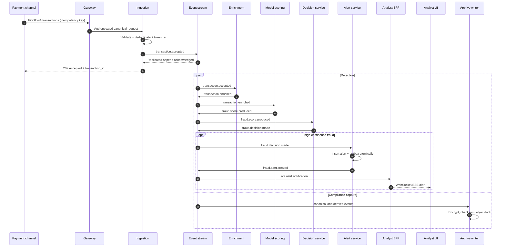

The acceptance boundary is the successful replicated append, not receipt at the gateway. A `202` means the bank owns a durable copy and can finish processing it. If the use case requires a decision before payment authorization, the channel calls `POST /v1/decisions` and waits within an agreed deadline; the implementation still persists the input before scoring.

### State and failure transitions

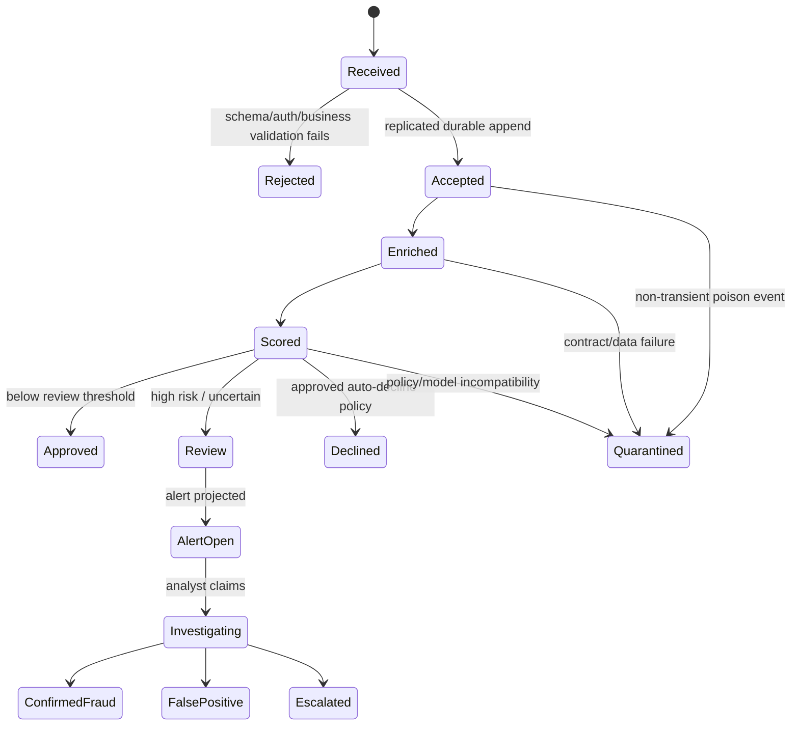

Transient failures retry with exponential backoff and jitter without advancing the consumer offset. After a bounded number of attempts, non-transient events move to a quarantine topic containing the original envelope and sanitized failure metadata. Operators repair and replay them through an approved workflow; a dead-letter queue is not a disposal mechanism.

## 7. Event design

### Event catalogue

| Event | Why and when it is emitted | Publisher | Consumers |
|---|---|---|---|
| `transaction.accepted.v1` | Canonical transaction has passed validation and is durably owned | Ingestion | Enrichment, archive, acceptance monitor |
| `transaction.rejected.v1` | Input cannot be accepted; supports producer feedback and audit | Ingestion | Reporting, archive, producer-support projection |
| `transaction.enriched.v1` | Required context and feature keys are attached | Enrichment | Model scoring, archive |
| `fraud.score.produced.v1` | Approved model completed inference | Model scoring | Rules/decision, model monitoring, archive |
| `fraud.decision.made.v1` | Score and policy have produced an actionable disposition | Decision | Alerting, payment integration, reporting, archive |
| `fraud.alert.created.v1` | A unique alert is committed | Alert service outbox | BFF push projection, case management, reporting |
| `fraud.alert.updated.v1` | Ownership, status, notes, or disposition changed | Alert service outbox | BFF, reporting, case management, audit archive |
| `reference.*.changed.v1` | Source data changed and local views must update | Bank data adapters | Enrichment, feature pipelines |
| `model.deployment.changed.v1` | Model was staged, promoted, rolled back or retired | Model controller | Scoring fleet, governance archive, monitoring |

### Event envelope and example schema

Avro or Protobuf contracts are registered under backward-compatible evolution rules. The envelope is consistent across topics; sensitive fields are classified and schema linting blocks prohibited data.

```json
{
  "event_id": "01J7...ULID",
  "event_type": "transaction.accepted",
  "event_version": 1,
  "occurred_at": "2026-08-14T09:15:31.123Z",
  "produced_at": "2026-08-14T09:15:31.151Z",
  "producer": "transaction-ingestion",
  "correlation_id": "01J7...",
  "causation_id": "01J7...request",
  "traceparent": "00-<trace-id>-<span-id>-01",
  "partition_key": "account-token-42",
  "data_classification": "CONFIDENTIAL",
  "replay": { "is_replay": false, "replay_id": null },
  "payload": {
    "transaction_id": "txn-9821",
    "account_token": "acct-tkn-42",
    "amount": { "minor_units": 2599, "currency": "GBP" },
    "merchant": { "id": "m-101", "category_code": "5411", "country": "GB" },
    "channel": "CARD_PRESENT",
    "occurred_at": "2026-08-14T09:15:31.100Z"
  }
}
```

The decision payload additionally includes `score`, `risk_band`, `decision`, `reason_codes`, `model_id`, `model_version`, `feature_set_version`, `ruleset_version`, input-data freshness, and inference timestamp. This is the minimum evidence required to reproduce and explain an outcome.

### Partitioning, ordering, and delivery semantics

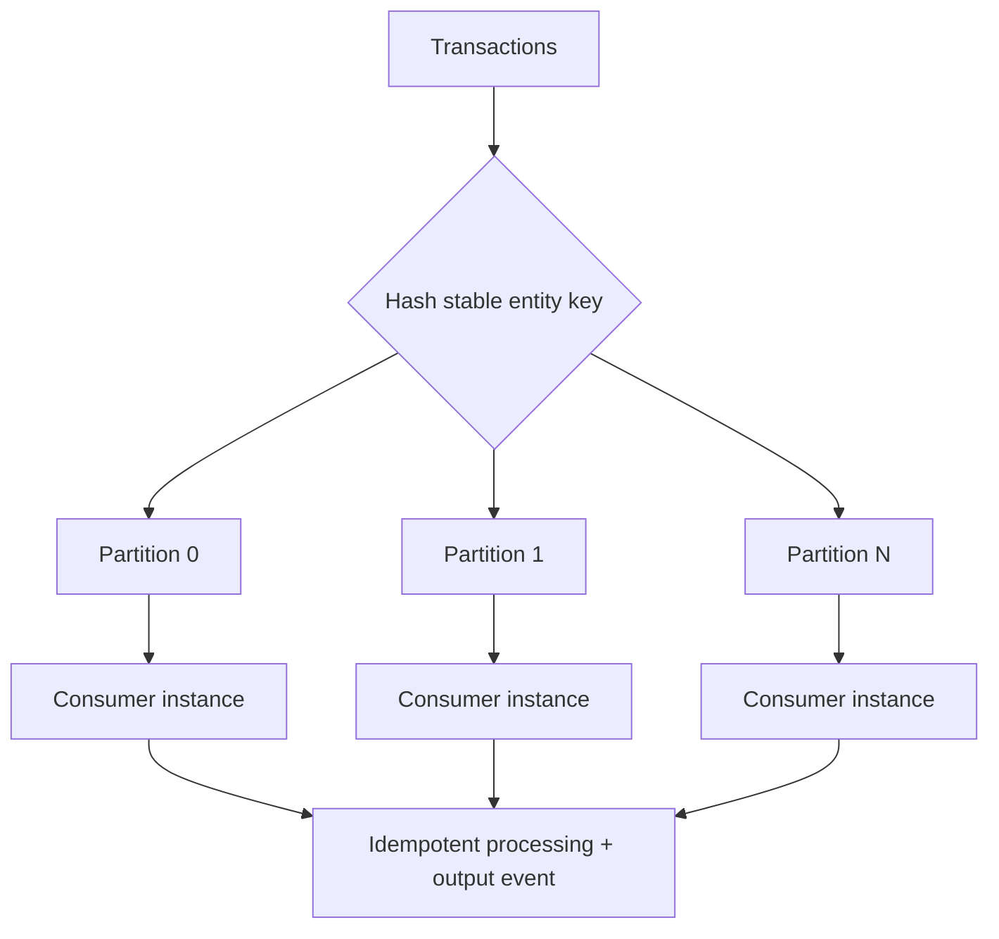

- Partition by `account_token` when per-account ordering and velocity features matter. A `transaction_id` key distributes more evenly but loses per-account ordering; exceptionally hot accounts require salting or a two-stage aggregate.
- Ordering is guaranteed only within a partition. Business logic must not assume global order and must handle late events using event time and watermarks.
- Delivery is **at least once**. Each consumer stores processed `event_id` values or uses an idempotent upsert keyed by business identity. Alert uniqueness is enforced on `(transaction_id, decision_version)`.
- Producer idempotence, `acks=all`, replication factor 3, and minimum in-sync replicas 2 protect acknowledged writes. Broker retention exceeds the worst credible consumer outage plus recovery margin.
- The outbox pattern atomically commits an alert state change and an outbox row; a relay publishes it and marks it delivered. This prevents a committed alert without a notification event.

```mermaid
sequenceDiagram
    participant C as Alert consumer
    participant DB as Alert database
    participant R as Outbox relay
    participant K as Event stream
    C->>DB: BEGIN
    C->>DB: UPSERT alert (unique business key)
    C->>DB: INSERT outbox event
    C->>DB: COMMIT
    R->>DB: Poll unpublished outbox rows
    R->>K: Publish fraud.alert.created
    K-->>R: Ack
    R->>DB: Mark published
    Note over C,K: Duplicate delivery is safe; consumers deduplicate by event_id/business key
```

### Schema evolution

- Add optional fields with defaults for backward-compatible changes; never reuse field identifiers.
- Breaking semantic changes create a new event version/topic and run both versions during migration.
- CI runs producer/consumer contract tests against the schema registry compatibility mode.
- Consumers preserve unknown fields where the serialization technology allows and tolerate additive change.

## 8. Replay and compliance design

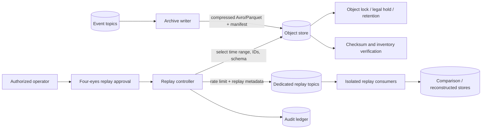

Kafka is not the only compliance archive. Canonical and derived events are continuously written to encrypted object storage with write-once-read-many object lock, retention policy, checksums, inventory reports, and legal hold support. Lifecycle tiers older data to lower-cost storage without changing integrity controls.

Every replay has a manifest containing approvers, purpose, selection predicate, code/model/schema versions, expected count and checksum. Replays use separate topics and consumer groups, carry `is_replay=true`, and default to isolated output stores so they cannot send duplicate alerts or declines. Promotion of reconstructed state is a separate approved operation. Quarterly restore tests prove that archived data is readable and produces reconciled counts; merely retaining bytes is insufficient.

Retention periods, erasure restrictions, cross-border location, and legal-hold rules must be set by Legal per data class and jurisdiction. Tokenization permits deletion/restriction at the identity mapping layer without corrupting transaction evidence where regulation requires retention.

## 9. Frontend and BFF architecture

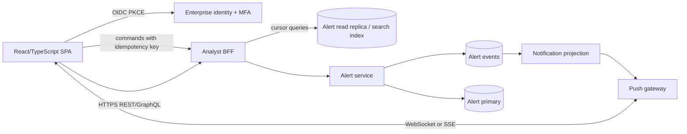

The Backend for Frontend (BFF) is justified because it centralizes field-level authorization, hides internal service topology, returns screen-shaped responses, and manages live subscriptions. It must remain thin: alert lifecycle rules belong to the Alert service.

Frontend responsiveness techniques:

- Server-side cursor pagination, indexed filters, and bounded date ranges; never download the whole alert queue.
- WebSocket for bidirectional features or SSE for simpler one-way alert delivery. On reconnect, the client sends the last observed sequence and performs a delta query so push is an acceleration, not the source of truth.
- Virtualized tables, code splitting, compressed assets through a CDN, and optimistic UI only for reversible commands. The server response remains authoritative.
- Short private caching for stable reference data and aggregate counts; no shared caching of PII-bearing alert detail. Use ETags and `Cache-Control: private`.
- Prioritize alert summaries and lazy-load evidence. Stale state is visibly timestamped.
- Accessibility to WCAG 2.2 AA, keyboard-first triage, clear severity/reason codes, and no color-only risk communication.

The UI provides alert age, calibrated score, confidence/risk band, top reason codes, model/rules versions, transaction timeline, related activity, assignment, notes, and disposition. Analyst actions are append-only audited with actor, role, time, reason, before/after state, and correlation ID.

## 10. Deployment, elasticity, resilience, and service mesh

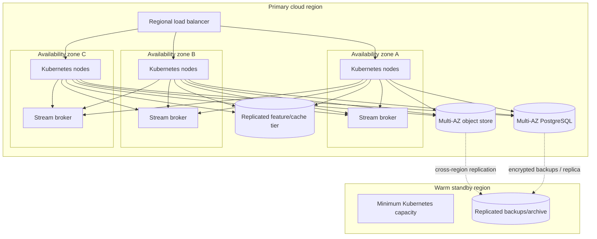

### Scaling and capacity

- Deploy stateless services on managed Kubernetes across three zones with topology-spread constraints, pod disruption budgets, anti-affinity, resource requests/limits, and priority classes.
- KEDA/HPA scales stream consumers using maximum of consumer lag, lag growth rate, processing rate, p95 latency, CPU, and model accelerator utilization. HTTP services scale on concurrency/RPS and latency, not CPU alone.
- Keep a tested minimum warm scoring fleet so cold starts do not violate real-time SLOs. Scale down gradually to avoid oscillation; pre-scale for predictable paydays and sales events.
- Consumer concurrency cannot exceed useful partition count. Initial partition count is derived by benchmark, then provisioned with at least 2x peak headroom. A practical starting hypothesis is 24–48 partitions, validated rather than assumed.
- Load-test at 2,000 TPS, twice the stated peak, including realistic skew, 2 KB median and large-tail events, retries, broker rebalance, node loss, and a 60-minute soak. Capacity passes only if SLOs hold and backlog drains within the recovery objective.

### Resilience patterns

- Timeouts, bounded exponential retry with jitter, bulkheads, circuit breakers, health probes, and graceful shutdown/offset handling.
- Load shedding prioritizes transaction detection over reports and nonessential UI aggregates. Backpressure is visible through lag and oldest-event age.
- Multi-AZ quorum for stream and database; automated backups and point-in-time recovery. Failover exercises validate provisional targets of RPO ≤ 1 minute and RTO ≤ 30 minutes for regional disaster, subject to business approval.
- Feature-store outage fallback uses a small, explicitly approved safe feature subset and emits a `degraded=true` decision, or routes to manual review. It never silently substitutes missing values.
- A model kill switch rolls back to the last approved model/rules package. Shadow and canary scoring detect regressions without immediately affecting decisions.

### Service mesh decision

A lightweight service mesh such as Istio ambient mode or Linkerd provides workload mTLS, service identity, authorization policy, consistent traffic telemetry, and controlled canary routing. It does **not** mediate Kafka message semantics, replace application authorization, or justify automatic retries of non-idempotent requests. The operational cost—sidecar/mesh upgrades, added latency, debugging complexity, and certificate-policy management—is worthwhile only if the bank platform team operates it as a shared capability. If no mature mesh platform exists, use cloud workload identity, network policy, SDK-based OpenTelemetry, and gateway-level traffic management first.

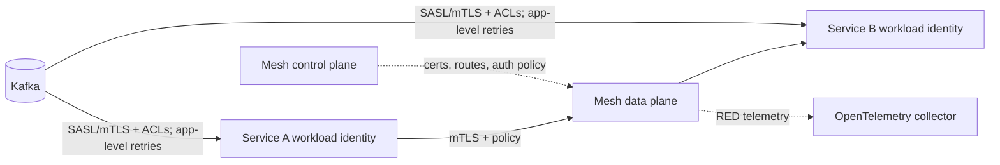

## 11. Observability and operations

### Telemetry architecture

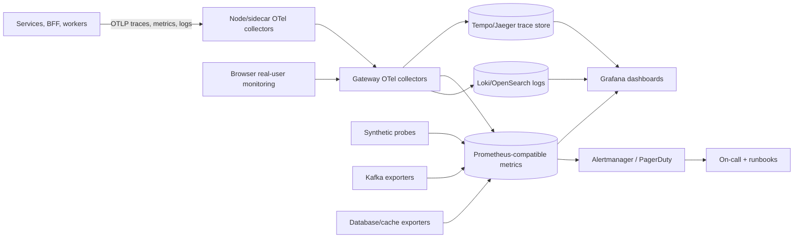

Use the OpenTelemetry SDK and W3C Trace Context. Propagate `traceparent` in HTTP and event headers; create producer and consumer spans linked across asynchronous boundaries. Tail-sample all errors, high-latency requests, replays, and high-risk decisions, plus a small baseline sample. Metrics, not 100% trace retention, measure SLOs.

Structured JSON logs include timestamp, severity, service, environment, deployment version, event name, trace/span IDs, correlation/causation IDs, transaction token, event ID, model/rules versions, retry count, and sanitized error code. Logs must never contain PAN, CVV, secrets, raw access tokens, or unapproved PII. Central redaction, field allowlists, access auditing, and retention by data class reduce leakage risk.

### Signals to instrument

| Layer | Metrics and diagnostic data |
|---|---|
| Ingestion | Request rate, accepted/rejected/deduplicated totals, p50/p95/p99 append latency, response codes, auth failures, producer throttling |
| Stream | Producer error rate, bytes/events per second, consumer lag and **oldest event age** by group/partition, under-replicated partitions, ISR count, disk utilization, rebalance duration |
| Enrichment/features | Processing latency, reference-view freshness, feature lookup latency/error/cache-hit rate, missing/stale feature ratio |
| Model | Inference p50/p95/p99, throughput, error/timeout rate, active model version, score distribution, feature drift, prediction drift, calibration, later-confirmed precision/recall and false-positive rate |
| Decision | End-to-end latency from `occurred_at` and `accepted_at`, decision totals by risk band, degraded/fallback decisions, rules version, duplicate suppression |
| Alerts/UI | Decision-to-alert age, open/high-risk queue age, push connection/drop/reconnect rate, BFF latency/error rate, assignment and time-to-first-action |
| Data quality | Required-field completeness, invalid currency/country codes, event-time skew, duplicate IDs, quarantine volume and age, archive reconciliation count/checksum |
| Platform | CPU/memory throttling, pod restarts/OOM, desired/available replicas, autoscaler saturation, DB connections/locks/replication lag, cache evictions, certificate expiry |
| Security | Denied authorization, anomalous access, secret/key failures, privileged actions, audit-log delivery lag |

Model quality metrics mature only after analyst outcomes or chargebacks arrive. Monitor by channel, geography, customer segment, and other legally reviewed cohorts to expose aggregate regressions and unfair impact without creating uncontrolled sensitive attributes.

### Proposed service-level objectives

Measured over a rolling 30 days unless stated otherwise; planned maintenance is not automatically excluded. SLOs require Risk and business approval before production.

| SLI / SLO | Objective | Measurement |
|---|---|---|
| Durable ingestion availability | ≥ 99.99% of valid transaction submissions receive a replicated durable-accept acknowledgment within 250 ms | Successful eligible requests / all eligible requests at gateway and broker ack |
| Detection latency | ≥ 99.9% of accepted transactions receive a final decision within 500 ms; ≥ 99.99% within 2 s | Decision `produced_at` − acceptance timestamp, excluding approved replays |
| Detection completeness | ≥ 99.999% of accepted transaction IDs have exactly one current final decision within 5 minutes | Continuous reconciliation of accepted vs decision IDs |
| Alert freshness | ≥ 99.9% of high-confidence fraud decisions appear in the analyst read model within 1 s | Read-model commit − decision timestamp |
| Analyst API responsiveness | ≥ 99% of eligible alert-list/detail requests complete within 200 ms and ≥ 99.9% within 750 ms | Server request histogram, excluding rejected auth and client cancellations |
| Analyst API availability | ≥ 99.95% of valid BFF requests are successful | Non-5xx eligible responses / eligible requests |
| Reference freshness | ≥ 99.9% of required reference-view updates are visible to enrichment within 5 s | Projection watermark − source event time |
| Archive completeness | 100% of accepted and decision events are archived and checksum-reconciled within 15 minutes | Stream/archive manifest reconciliation |
| Recovery processing | After load returns to ≤ 1,000 TPS, oldest-event age returns below 2 s within 10 minutes | Consumer oldest-event-age metric |

For the 99.9% detection-latency SLO, the 30-day error budget is 0.1% of accepted transactions. Burn-rate alerts page on both a fast window (for example 14.4× burn over 5 minutes confirmed over 1 hour) and a slow window (for example 2× over 6 hours confirmed over 3 days). Exact windows follow the bank's incident policy.

### Alert routing

- **Page immediately:** fast/slow SLO burn; missing decisions; oldest-event age threatening the latency SLO; under-replicated stream partitions; archive lag approaching retention; scoring error spike; invalid model version; high-risk alert projection stopped; audit pipeline failure.
- **Ticket/business hours:** capacity forecast, gradual data/model drift, elevated false-positive rate, disk growth, noncritical report delay.
- Every actionable alert identifies user impact, includes dashboard and trace links, names an owner, and links a tested runbook. Alerts based only on CPU are diagnostic, not evidence of customer impact.

## 12. Security, privacy, and model governance

```mermaid
flowchart TB
    EXT[External / bank producer] -->|mTLS, OAuth2, schema validation| EDGE[Gateway]
    EDGE -->|private endpoint| APP[Workloads with identities]
    APP -->|topic ACLs| BUS[(Encrypted stream)]
    APP -->|least-privilege role| DATA[(Encrypted data stores)]
    KMS[KMS/HSM] -. envelope keys + rotation .-> BUS & DATA
    IAM[Central IAM] -. RBAC/ABAC + MFA + JIT privilege .-> EDGE & APP
    SEC[SIEM/SOC] <-->|security events| EDGE & APP & BUS & DATA
    AUD[(Tamper-evident audit)] <-- APP
```

- TLS 1.2+ externally and mTLS/service identity internally; private networking, restrictive egress, topic ACLs, network policies, and separate production accounts/projects.
- Envelope encryption with KMS/HSM-managed keys; key rotation and separation of key administrators from data administrators.
- Tokenize account/card identifiers at ingress. Do not store CVV. Enforce PCI DSS scope controls, data classification, DLP scanning, and purpose-bound access.
- Workforce SSO with phishing-resistant MFA; RBAC plus attributes such as region and case assignment; just-in-time privileged access and dual control for replay, rules, model, retention, and key changes.
- Append-only, tamper-evident audit records for reads of sensitive records and every state/configuration change; export to the SIEM under independent retention.
- Signed images and model artifacts, SBOMs, dependency/image scanning, admission policies, provenance attestations, secret manager integration, and no static credentials.

The model registry records training dataset lineage, feature definitions, validation results, bias/fairness assessment, approvers, intended use, threshold, and artifact digest. Deployment uses shadow traffic, canary cohorts, objective promotion gates, and automatic rollback. Every decision stores the exact model and feature/rules versions plus reason codes. Analyst outcomes feed delayed quality monitoring and retraining only through governed pipelines; raw feedback must not automatically alter production behavior.

## 13. Technology stack

Product names are reference choices, not irreversible commitments; managed services should be selected through the bank's approved cloud catalogue.

| Layer | Proposed technology | Rationale and caveat |
|---|---|---|
| Runtime | Managed Kubernetes, containers, KEDA/HPA | Portable horizontal scaling and mature controls; requires platform/SRE maturity |
| API edge | Cloud API Gateway + WAF + private load balancer | Managed DDoS/WAF, mTLS/OAuth, quotas; potential vendor coupling |
| Services | Java/Kotlin with Spring Boot or Go; Python only where model library requires it | Strong typed contracts and predictable runtime; standardize to reduce polyglot burden |
| Event backbone | Managed Apache Kafka-compatible service + schema registry | Ordering by partition, replay, high throughput and broad ecosystem; operational/cost complexity |
| Event contracts | Avro with registry | Compact payloads and enforceable evolution; less human-readable than JSON |
| Alert workflow store | Managed PostgreSQL, Multi-AZ | Transactions, constraints, outbox, rich operational queries; must index and partition carefully |
| Online features/cache | Managed Redis-compatible cluster | Sub-millisecond/millisecond reads, TTL and atomic counters; memory cost and durability limitations mean it is not system of record |
| Analyst search | OpenSearch only if PostgreSQL indexes cannot meet search needs | Flexible faceting/full text; eventual consistency and another stateful projection |
| Compliance archive | Cloud object storage with object lock, versioning and lifecycle tiers | Durable, economical, immutable retention; retrieval latency on cold tiers |
| Analytics | Cloud warehouse/lakehouse populated asynchronously | Isolates heavy reports from detection; freshness is eventual |
| Model serving | KServe or a standardized inference service using ONNX Runtime | Versioned rollout and efficient inference; KServe adds platform complexity at this volume |
| Model registry | MLflow or approved managed ML registry | Lineage, approvals, artifact versions; governance process remains essential |
| Observability | OpenTelemetry, Prometheus-compatible metrics, Grafana, Tempo/Jaeger, Loki/OpenSearch, Alertmanager/PagerDuty | Open standards and cross-signal correlation; cardinality and retention need governance |
| Delivery/IaC | GitHub Actions or bank CI, Argo CD, Terraform, policy-as-code | Reviewed, repeatable deployments and drift control; protect pipeline identities and state |
| Identity/security | Enterprise OIDC, workload identity, secrets manager, KMS/HSM, SIEM | Central lifecycle and audit; design for provider outage and key recovery |
| Frontend | React + TypeScript, BFF REST/GraphQL, WebSocket/SSE | Mature UI ecosystem and live updates; GraphQL only if screen aggregation warrants it |

### Why not serverless functions for the complete hot path?

Functions are attractive for burst scaling and low idle cost, but model cold starts, execution variability, connection management, and per-request cost reduce predictability. They remain suitable for low-volume integrations, scheduled reconciliation, and archive lifecycle tasks. Warm containerized scoring workers provide tighter latency control while still autoscaling.

## 14. Patterns and their contribution

| Pattern | Benefit | Cost / control |
|---|---|---|
| Event-driven architecture | Burst buffering, independent scaling, replay, failure isolation | Eventual consistency and harder debugging; mitigate with contracts, correlation, idempotency and reconciliation |
| CQRS/materialized views | Fast analyst and reporting queries without loading hot path | Projection lag and duplicated data; show freshness and rebuild from events |
| Transactional outbox | Prevents database/event dual-write loss | Relay and duplicate handling; monitor outbox age |
| Idempotent consumer | Makes at-least-once delivery safe | Deduplication storage/logic; define stable business keys |
| BFF | Screen-shaped APIs, central UI authorization, push management | Extra service and risk of business-logic leakage; keep domain rules in owner services |
| Cache-aside / local policy cache | Low-latency reads and reduced dependency load | Staleness and invalidation; version, TTL, freshness SLI and safe fallback |
| Service mesh | Workload mTLS, traffic policy, consistent network telemetry | Operational complexity/latency; adopt only as supported platform capability |
| Bulkhead/circuit breaker | Prevents one dependency exhausting the pipeline | Degraded decisions; surface and audit every fallback |
| Strangler migration | Parallel transition from batch with controlled risk | Temporary duplication and reconciliation complexity |

## 15. Critical trade-offs and challenges

### Latency versus correctness and durability

Acknowledging only after a replicated stream append adds latency but establishes a clear no-loss boundary. In financial services this is preferable to acknowledging an in-memory receipt. Aggressive asynchronous processing improves availability, but payment authorization may need a synchronous decision. That path must use an end-to-end deadline and an explicit risk policy; retries cannot exceed the caller's budget.

### At-least-once versus “exactly once”

Broker transactions can improve stream-to-stream guarantees, but exactly-once claims end at external databases and APIs. Business-level idempotency, uniqueness constraints, outbox, and reconciliation are easier to audit. The cost is deduplication state and careful contract design.

### Availability versus fraud risk

Fail-open keeps payments flowing but may permit fraud; fail-closed reduces fraud exposure but harms customers and could create systemic availability impact. The answer varies by transaction type, amount, regulation, and outage duration. Encode a versioned policy matrix approved by Risk rather than a universal technical default. Manual review is a third option with limited capacity.

### Freshness versus dependency fan-out

Local reference projections keep latency predictable during upstream outages but introduce staleness. Timestamp features, enforce freshness limits, and route materially stale decisions through a governed fallback. Synchronous lookup of every source appears current but makes the weakest dependency define system availability.

### Model accuracy versus explainability

Complex models may catch more fraud but be difficult to explain and operate. Store reason codes and lineage, use calibrated thresholds, monitor cohorts and drift, and retain a deterministic rules layer. A slightly less accurate but stable, reviewable model may be the safer regulated choice.

### Elasticity versus cold-start latency

Scaling to zero is economical but incompatible with strict real-time tails. Maintain minimum warm inference capacity, pre-scale known peaks, and use lag-driven scale-out. This accepts modest idle cost to protect the compliance SLO.

### Stream retention versus immutable archive

Long broker retention simplifies replay but is expensive and operationally risky. A shorter operational window plus object-locked archive is cheaper and stronger for compliance, but archived replay is slower and needs manifests and restore tooling.

### Multi-region consistency versus complexity

Active-active writes lower regional failover time but make ordering, feature consistency, duplicate suppression, data residency, and Kafka replication substantially harder. Begin with Multi-AZ primary plus warm standby unless business impact analysis proves active-active is necessary. Practice failover and quantify RPO/RTO rather than claiming “high availability.”

### False positives and analyst overload

Low thresholds increase recall while overwhelming analysts and harming customers. Track alert precision, queue age, analyst capacity, and time to action alongside technical latency. Use priority bands, calibrated confidence, related-event grouping, and feedback governance. Never optimize model recall without an operational cost function.

## 16. Migration and delivery plan

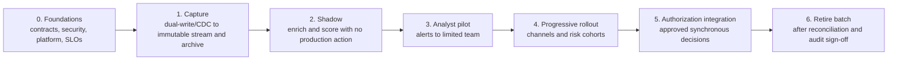

1. **Foundations:** agree canonical contract, data classifications, threat model, SLOs, partition benchmarks, runbooks, ownership, IaC, and test environments.
2. **Capture:** mirror production transactions into the new stream and immutable archive. Reconcile counts, amounts, IDs, checksums, and late arrivals against the ledger.
3. **Shadow scoring:** run the new pipeline without affecting customers or analysts. Compare with the batch system and known outcomes; measure latency, drift and cost.
4. **Analyst pilot:** expose alerts to a small team, validate reason codes, accessibility, queue behavior, audit trail, and case integration.
5. **Progressive rollout:** canary by channel/region/risk cohort with automated rollback gates. Preserve the batch system as an independent comparison during the agreed proving period.
6. **Authorization integration:** enable auto-action only for approved cohorts after legal, model-risk, operations, security and resilience sign-off.
7. **Decommission:** archive required legacy evidence, remove dual operation, revoke credentials, and update disaster recovery and regulatory documentation.

### Required verification before production

- Contract, unit, integration, property, and end-to-end tests, including duplicate and out-of-order events.
- 2,000 TPS load/soak testing with skew, autoscaling and backlog recovery.
- Chaos tests for node, zone, broker, database, feature store, model, identity and telemetry failures.
- Security testing: threat model, SAST/DAST, dependency and image scanning, penetration test, key/secret rotation, authorization tests, audit immutability.
- Model validation: data lineage, leakage checks, calibration, explainability, cohort performance, adversarial input and rollback.
- Restore/replay exercise with manifest reconciliation, plus regional DR exercise against approved RPO/RTO.
- Operational readiness review: dashboards, burn-rate alerts, runbooks, on-call ownership, capacity model, support training, and incident simulations.

## 17. Architecture decisions and open approvals

### Decisions proposed

| ID | Decision | Rationale |
|---|---|---|
| ADR-001 | Durable event log is the acceptance boundary | Prevents acknowledged-loss ambiguity and decouples processing |
| ADR-002 | Object-locked archive is the long-term compliance record | Lower cost and stronger immutability than relying only on broker retention |
| ADR-003 | At-least-once delivery with idempotent business effects | Honest end-to-end guarantee across databases and external APIs |
| ADR-004 | Separate scoring from deterministic decision policy | Independent model and policy governance, explainability and rollback |
| ADR-005 | CQRS read model and BFF for analysts | Responsive UI without coupling it to detection internals |
| ADR-006 | Multi-AZ primary and warm-region DR initially | Reduces consistency complexity while meeting provisional recovery targets |
| ADR-007 | OpenTelemetry as the telemetry standard | Vendor-neutral propagation and correlation across synchronous and event flows |

### Items requiring stakeholder approval

- Per-payment-type timeout and fail-open/fail-closed/manual-review policy.
- Alert and automatic-decline thresholds, plus target precision/recall and cohort constraints.
- Jurisdiction-specific retention, residency, lawful erasure, and legal-hold rules.
- Final SLO/error budgets, regional RPO/RTO, and whether active-active is justified.
- Acceptable reference-data age and model fallback behavior.
- Whether the existing platform's service mesh maturity justifies adoption.
- Analyst concurrency, alert volumes, and workflow/case-management integration requirements.

## 18. Conclusion

This architecture meets the stated real-time, replayability, 1,000 TPS, elasticity, analyst-alerting, and observability requirements through a durable event backbone, independently scalable services, immutable archival, query-specific projections, and measurable SLOs. Its central financial-services stance is that low latency must not erase evidence: accepted input, model and rules versions, decisions, alerts, analyst actions, and replay activity form one traceable audit chain. The remaining decisions are principally risk-policy and regulatory choices, and they are deliberately exposed rather than hidden inside implementation defaults.
